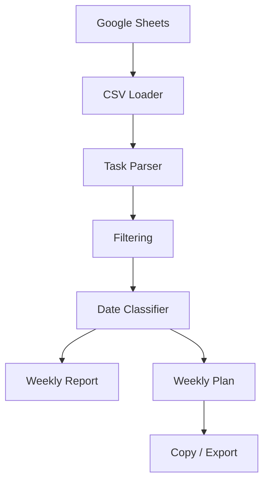

<div align="center">

# 🟢 ПЛАНИФИКАТОР-3000

### Google Sheets → недельный отчёт → план на неделю

**Не придумывай. Не угадывай. Не усложняй.**


</div>

---

## ✨ Что это

**ПЛАНИФИКАТОР-3000** — MVP-сервис для командного недельного планирования.

Он берёт задачи из Google Sheets, очищает служебные строки, учитывает даты задач и собирает:

* отчёт за прошедшую неделю;
* план на текущую неделю;
* список задач для копирования;
* базовые счётчики нагрузки.

---

## 🧠 Product DNA

> Light SaaS tool.
> Минимум шума.
> Максимум пользы.
> Система не заменяет решение человека — она экономит время на рутине.

---

## 🧩 Как работает



---

## 📊 Формат Google Sheets

| Column | Purpose                        |
| ------ | ------------------------------ |
| A      | Название задачи                |
| B      | Дата создания задачи           |
| C      | Ссылка на задачу, игнорируется |

Формула для B3 и ниже:

```text
=IF(A3<>""; IF(B3<>""; B3; TODAY()); "")
```

---

## 🧹 Автофильтр

Система игнорирует:

* Важные незапланированные проекты
* Текущие задачи месяца
* Задачи от соседних отделов
* Название задачи
* Ссылка на задачу
* пустые строки
* ссылки
* служебные заголовки

---

## 🏗️ Архитектура

```text
apps/
├── web      Next.js frontend
└── api      FastAPI backend

packages/
├── ui       shared UI package
├── shared   shared contracts
└── config   shared TypeScript configs
```

---

## 🚀 Production URLs

| Service | URL                                                                                                  |
| ------- | ---------------------------------------------------------------------------------------------------- |
| Web     | [https://planner3000web-production.up.railway.app](https://planner3000web-production.up.railway.app) |
| API     | [https://api-production-4656.up.railway.app](https://api-production-4656.up.railway.app)             |

---

## ⚙️ Railway services

```text
Single Railway Project
├── planner3000/web
└── api
```

### Web

```text
Dockerfile path: apps/web/Dockerfile
Public port: 8080
Healthcheck: /
```

### API

```text
Dockerfile path: apps/api/Dockerfile
Public port: 8000
Healthcheck: /api/health
```

---

## 🔐 Environment variables

### API

```env
APP_ENV=local
API_PREFIX=/api
PORT=8000
CORS_ORIGINS=https://planner3000web-production.up.railway.app
```

Future production variables:

```env
GOOGLE_SHEET_ID=
GOOGLE_SERVICE_ACCOUNT_JSON=
```

### Web

```env
NEXT_PUBLIC_API_URL=https://api-production-4656.up.railway.app
NEXT_PUBLIC_APP_URL=https://planner3000web-production.up.railway.app
```

---

## 🧪 Local commands

```bash
pnpm install
pnpm typecheck
pnpm build
```

API:

```bash
cd apps/api
uv run fastapi dev app/main.py
```

Web:

```bash
pnpm --filter @planner3000/web dev
```

---

## ✅ Current MVP status

| Area                            | Status    |
| ------------------------------- | --------- |
| Web UI                          | ✅ Ready   |
| Railway web deploy              | ✅ Ready   |
| API deploy                      | ✅ Ready   |
| Health endpoint                 | ✅ Ready   |
| Smoke endpoint                  | ✅ Ready   |
| Google Sheets public CSV import | ✅ MVP     |
| Google Sheets API backend       | ⏳ Backlog |
| AI planning assistant           | ⏳ Backlog |

---

## 🛣️ Next milestones

1. Move Google Sheets loading to FastAPI.
2. Add Google Sheets API service account.
3. Auto-detect latest month tab.
4. Add real task history.
5. Add routine detection.
6. Add AI normalization through backend only.

---

<div align="center">

Made for practical weekly planning.

**ПЛАНИФИКАТОР-3000**

</div>
